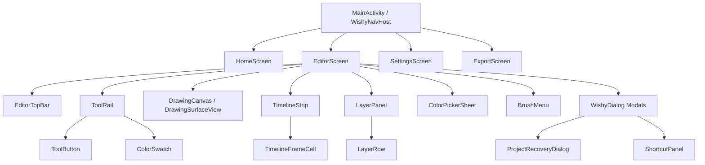

# 06 — COMPONENT MAP

## Component Architecture & Relationships

---

## Detailed Component Specifications

| Component Name | File Path | State Dependencies | UI Role & Responsibilities |
| :--- | :--- | :--- | :--- |
| **`WishyNavHost`** | [`MainActivity.kt`](file:///home/denji/Documents/new/WishyClip/app/src/main/java/org/wishyclip/app/MainActivity.kt) | `currentTokens`, `isLeftHanded`, `navController` | App root shell, navigation router, edge-to-edge system bar synchronization |
| **`HomeScreen`** | [`HomeScreen.kt`](file:///home/denji/Documents/new/WishyClip/app/src/main/java/org/wishyclip/app/ui/screens/HomeScreen.kt) | `HomeViewModel.projects` | Project grid display, create new project launcher, project deletion & export launcher |
| **`EditorScreen`** | [`EditorScreen.kt`](file:///home/denji/Documents/new/WishyClip/app/src/main/java/org/wishyclip/app/ui/screens/EditorScreen.kt) | `EditorViewModel`, `CanvasViewState`, panel visibility booleans | Primary animation workspace container, layout responder for orientation and left-handed mode |
| **`EditorTopBar`** | [`EditorScreen.kt`](file:///home/denji/Documents/new/WishyClip/app/src/main/java/org/wishyclip/app/ui/screens/EditorScreen.kt) | `project.name`, `canUndo`, `canRedo`, `isPlaying`, `showLayers` | Top bar header with back action, title, undo/redo, play/pause toggle, layers panel toggle, overflow menu |
| **`ToolRail`** | [`ToolRail.kt`](file:///home/denji/Documents/new/WishyClip/app/src/main/java/org/wishyclip/app/ui/components/ToolRail.kt) | `selectedTool`, `activeBrush`, `mirrorMode`, `rulerOn` | Floating rail containing primary tool selection buttons + modifier toggles + color swatch slot |
| **`ToolButton`** | [`ToolButton.kt`](file:///home/denji/Documents/new/WishyClip/app/src/main/java/org/wishyclip/app/ui/components/ToolButton.kt) | `iconRes`, `selected`, `onClick` | Reusable $44 \times 44\text{dp}$ tool button with pill container selection background and scale interaction |
| **`BrushMenu`** | [`BrushMenu.kt`](file:///home/denji/Documents/new/WishyClip/app/src/main/java/org/wishyclip/app/ui/components/BrushMenu.kt) | `activeBrush`, `brushSize`, `opacity`, `stabilizer`, `customBrushes` | Brush selection sheet, preset list, quick size/opacity/stabilizer sliders, live stroke preview |
| **`ColorPickerSheet`** | [`ColorPickerSheet.kt`](file:///home/denji/Documents/new/WishyClip/app/src/main/java/org/wishyclip/app/ui/components/ColorPickerSheet.kt) | `color`, `onColorChange` | HSV color wheel sheet, HEX text box, recent color swatches, eyedropper launch |
| **`ColorSwatch`** | [`ColorSwatch.kt`](file:///home/denji/Documents/new/WishyClip/app/src/main/java/org/wishyclip/app/ui/components/ColorSwatch.kt) | `color`, `onClick` | Circular color preview chip at end of tool rail |
| **`LayerPanel`** | [`LayerPanel.kt`](file:///home/denji/Documents/new/WishyClip/app/src/main/java/org/wishyclip/app/ui/components/LayerPanel.kt) | `layers`, `activeLayerIndex` | Layer stack panel, reorder triggers, add layer, import image as layer |
| **`LayerRow`** | [`LayerRow.kt`](file:///home/denji/Documents/new/WishyClip/app/src/main/java/org/wishyclip/app/ui/components/LayerRow.kt) | `LayerUi` (name, visible, opacity, locked, blendMode) | Layer row item with eye, lock, opacity slider, blend mode dropdown, move up/down, delete |
| **`TimelineStrip`** | [`TimelineStrip.kt`](file:///home/denji/Documents/new/WishyClip/app/src/main/java/org/wishyclip/app/ui/components/TimelineStrip.kt) | `frames`, `currentIndex`, `fps`, `audioTracks`, `onionEnabled` | Bottom timeline control bar (fps, frame count, duplicate, delete, onion) + frame cells LazyRow |
| **`TimelineFrameCell`** | [`TimelineFrameCell.kt`](file:///home/denji/Documents/new/WishyClip/app/src/main/java/org/wishyclip/app/ui/components/TimelineFrameCell.kt) | `frameIndex`, `selected`, `exposureDuration` | Individual frame cell thumbnail preview with selection border and exposure indicator |
| **`DrawingCanvas`** | [`DrawingCanvas.kt`](file:///home/denji/Documents/new/WishyClip/app/src/main/java/org/wishyclip/app/canvas/DrawingCanvas.kt) | `DrawingSurfaceView`, `CanvasViewState`, `StrokeRenderer` | Low-latency hardware SurfaceView canvas host handling 1-finger drawing, stylus pressure/tilt, and 2-finger pan/zoom/rotate |
| **`WishyDialog`** | [`WishyDialog.kt`](file:///home/denji/Documents/new/WishyClip/app/src/main/java/org/wishyclip/app/ui/components/WishyDialog.kt) | `title`, `onDismiss`, `confirmButton` | Standardized modal dialog container with rounded corners and dark theme surface styling |
| **`ProjectRecoveryDialog`** | [`WishyDialog.kt`](file:///home/denji/Documents/new/WishyClip/app/src/main/java/org/wishyclip/app/ui/components/WishyDialog.kt) | `orphanedProjectId`, `onRecover`, `onDiscard` | Startup dialog asking user if they want to restore unsaved project state after crash |
| **`ShortcutPanel`** | [`WishyDialog.kt`](file:///home/denji/Documents/new/WishyClip/app/src/main/java/org/wishyclip/app/ui/components/WishyDialog.kt) | `shortcutsList` | Modal displaying complete keyboard shortcuts cheat sheet |
