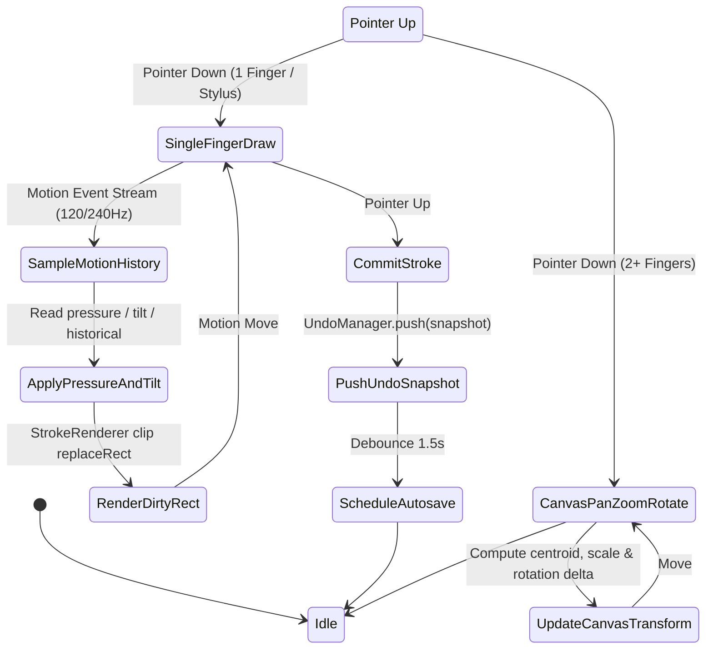
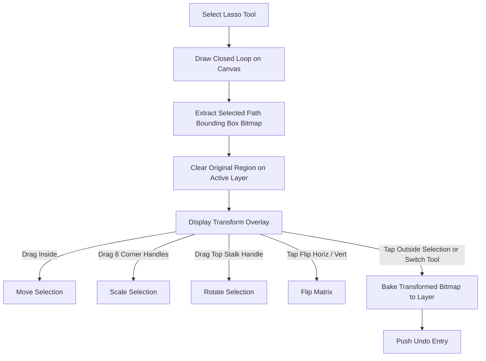

# 07 — INTERACTION MAP & STATE MACHINES

## 1. Primary User Interaction Flows

---

## 2. Interaction State Machine Specifications

### 2.1 Eyedropper Auto-Return Interaction
1. **Trigger**: User taps Eyedropper tool icon or holds color swatch.
2. **State Transition**: `toolBeforeEyedropper = vm.tool`; active tool set to `Tool.EYEDROPPER`.
3. **Gesture**: Drag finger / stylus across canvas. A circular magnifier lens overlay follows pointer, sampling composite visible pixel at point $(X, Y)$.
4. **Completion**: Pointer UP sets `vm.color = sampledColor`, restores `vm.tool = toolBeforeEyedropper`, and dismisses magnifier overlay.

### 2.2 Quick Size & Opacity Gesture Adjuster
1. **Trigger**: Long-press and drag on Brush tool button or Canvas adjustment handle.
2. **Visual Feedback**: A dark pill bubble appears directly above touch point showing live numeric value (e.g., `18 px` or `42%`) alongside a circle preview matching current color and size.
3. **Value Mapping**:
   - Vertical Drag Delta: Adjusts Size ($1\text{px}$ to $200\text{px}$).
   - Horizontal Drag Delta: Adjusts Opacity ($0\%$ to $100\%$).
4. **Completion**: Release touch hides bubble overlay after $150\text{ms}$ fade out.

### 2.3 Lasso Selection & Transform Workflow

### 2.4 Timeline Frame Exposure / Hold Duration
1. **Concept**: Instead of creating $5$ identical layer PNGs for a $5$-frame hold, frame exposure $N = 5$ sets the frame hold duration.
2. **Timeline Representation**: Frame cell displays duration width indicator badge (`x5`).
3. **Playback Loop Engine**: Frame stepper advances playback position ticker by $1$ per tick; when reaching an exposed frame, it holds image rendering until exposure count completes, maintaining flawless target FPS without IO or memory thrashing.

### 2.5 Crash Recovery State Flow
1. **On Launch**: `WishyApp` scans `filesDir/projects/recovery/` for uncommitted checkpoint journals.
2. **Condition**: If orphan checkpoint found, open `ProjectRecoveryDialog`.
3. **User Options**:
   - **Recover**: Load uncommitted layer PNGs, restore state, and commit to database.
   - **Discard**: Safely delete orphan checkpoint files.
