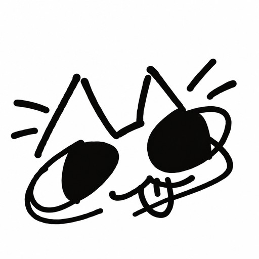

# Wishy Clip



**Wishy Clip** is a free, open-source frame-by-frame 2D animation app for Android. No ads, no paywalls, no subscriptions.

> *Wishy Clip is an independent open-source project and is not affiliated with or endorsed by FlipaClip or Vblast.*

---

## Features

- **Drawing**: pressure-sensitive strokes with a stabilizer, undo/redo, pinch zoom / pan / rotate (plus 90° rotate buttons), and 11 built-in brushes (Pen, Pencil, Marker, Airbrush, Calligraphy, Highlighter, Charcoal, Ink, Watercolor, Chalk, Pixel Pen) plus the Eraser.
- **Tools**: Fill (with tolerance), Lasso (freeform select with move / resize / rotate), Line / Rectangle / Ellipse, Text, Eyedropper (samples the colour you see, then returns to your previous tool).
- **Mirror**: symmetry drawing across the centre line: left/right, top/bottom or 4-way. Works with every brush, the eraser and shapes.
- **Ruler**: a movable, rotatable straight edge. Start a stroke beside it and the stroke snaps to its edge.
- **Layers**: add / delete / reorder, opacity, visibility, **lock**, **blend modes** (Normal, Multiply, Screen, Overlay, Darken, Lighten, Add) and **merge down**.
- **Animation**: frame timeline, copy / paste frames, onion skin, playback at project FPS, image / video import as frames.
- **Portrait and landscape**: the tool bar, panels and timeline re-arrange for each orientation (left-handed layout supported), panels scroll in short windows, and rotating the device keeps your canvas view.
- **Imported brushes**: tip-based brushes from community files (see below), with spacing, rotation, scatter and size jitter, usable with Mirror.

### Supported Brush Formats

Files are limited to 20 MB, 512 brushes per file, and tips up to 2048 px (stored at up to 512 px). Colour is applied at paint time, so every tip becomes a one-colour mask.

| Format | Extension | What is imported |
|---|---|---|
| Wishy Brush | `.wbrush` | ZIP with `brush.json` (name, spacing, angle, rotateWithStroke, scatter, sizeJitter, flow) and `tip.png` |
| Krita | `.kpp`, `.bundle` | Embedded tip, name, spacing and angle; presets without a tip get a soft round tip |
| Photoshop | `.abr` | Sampled (bitmap) tips, v1/v2 and v6+ (v6+ is located heuristically); computed round brushes are skipped |
| GIMP | `.gbr`, `.gih` | Tip and spacing (first brush of a `.gih` pipe) |
| Procreate | `.brush`, `.brushset` | `Shape.png` tip only (no grain, no dynamics) |

The parsers are tested against files built from each format's documented layout; they have **not** been verified against a large corpus of real-world brush packs, so some files may be rejected or look different.

- **Audio & Voiceover**: Import audio tracks, record voiceovers, and view synchronized waveforms directly on the timeline.
- **Export & Share**: Export high-performance MP4 videos (MediaCodec + MediaMuxer), animated GIFs, or PNG sequences.
- **Customizable Themes**: Light, Dark, AMOLED Black, Candy, and community JSON theme packs.

---

## Installation & APK

Download the latest signed release APK from the [GitHub Releases](https://github.com/wishyclip/wishyclip/releases) page.

---

## Building from Source

### Prerequisites
- Android Studio (Hedgehog or newer)
- JDK 17

### Build Steps
```bash
git clone https://github.com/wishyclip/wishyclip.git
cd wishyclip
./gradlew assembleDebug testDebugUnitTest
```

---

## Project Structure & Architecture

Wishy Clip follows an MVVM architecture with clean separation of concerns:
- `canvas/`: Drawing canvas, stroke renderer (path strokes, dab stamping, mirror), ruler and layer blending.
- `brush/`: Dependency-free brush file parsers and on-disk brush store (unit-testable on the plain JVM).
- `data/`: Room database entities, DAOs, repository, PNG layer storage and the brush library.
- `audio/`: ExoPlayer audio synchronization, voice recording, and waveform extraction.
- `export/`: MediaCodec MP4 encoder, animated GIF encoder, and foreground service.
- `ui/`: Jetpack Compose design system (`ui/design/`), reusable components (`ui/components/`), and screens (`ui/screens/`).

---

## Roadmap

- [x] Mirror, ruler, eyedropper
- [x] Layer lock, blend modes, merge down
- [x] Brush importers (`.wbrush`, `.kpp` / `.bundle`, `.abr`, `.gbr` / `.gih`, Procreate)
- [x] Portrait / landscape layouts that survive rotation
- [x] MP4, GIF and PNG-sequence export
- [x] Frame hold / exposure duration timeline (`exposureDuration` per frame)
- [x] Studio multi-track timeline and contextual drawing controls
- [ ] Tiled sparse layer storage (the `TileStore` / `BitmapPool` / LZ4 code exists but is not wired in; layers are still one PNG each)
- [ ] Transparent-background export
- [ ] Ruler variants (circle / ellipse / grid) and a movable mirror axis
- [ ] Stylus gesture shortcuts and custom shortcuts

---

## License & Credits

Licensed under the [Apache License 2.0](LICENSE). See [ATTRIBUTIONS.md](ATTRIBUTIONS.md) for third-party library and icon attributions (Phosphor Icons, Material Symbols, Fluent Emoji).
