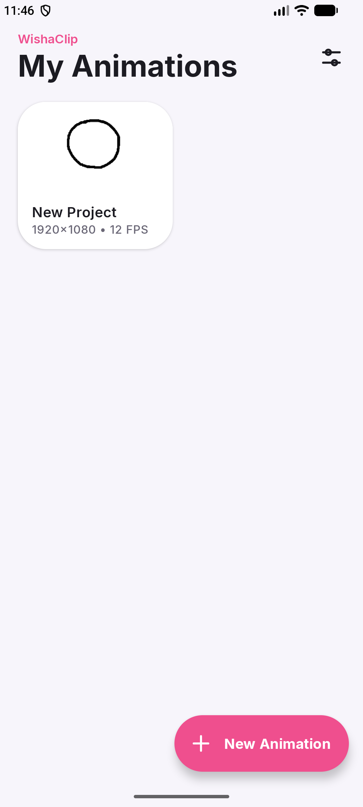
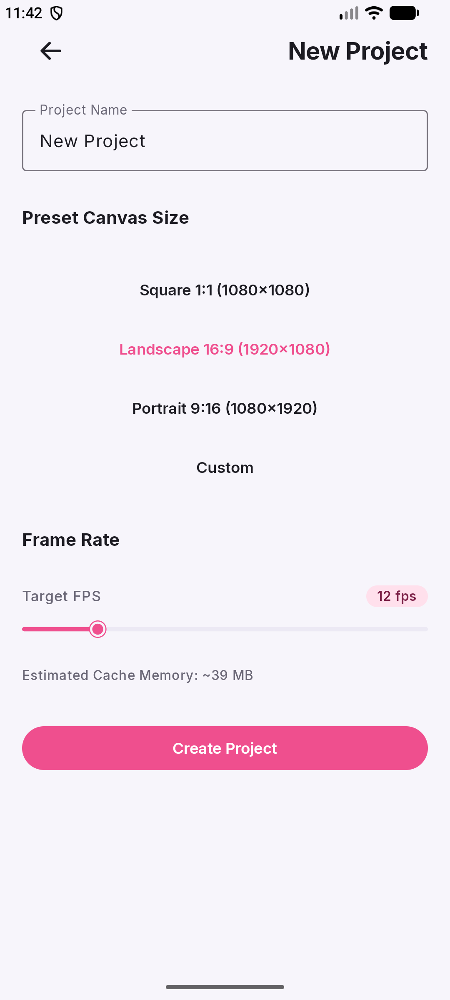
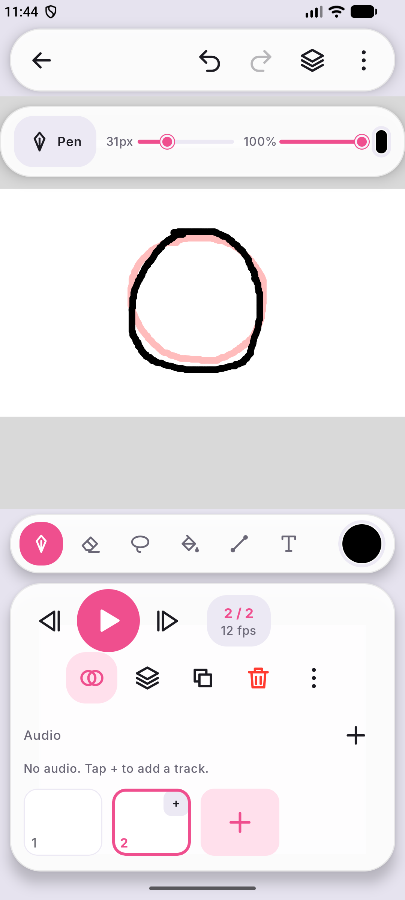
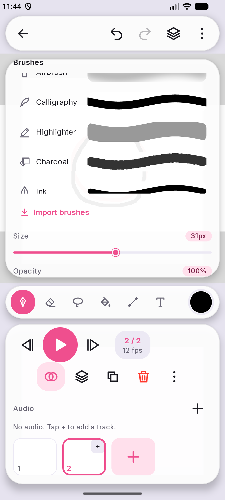
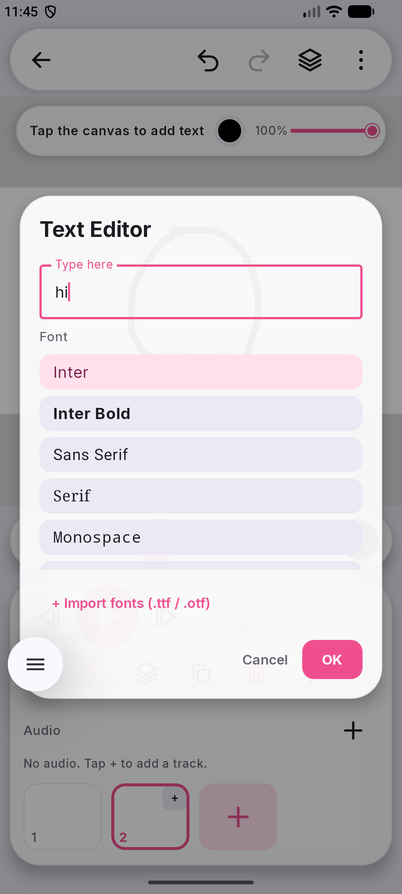
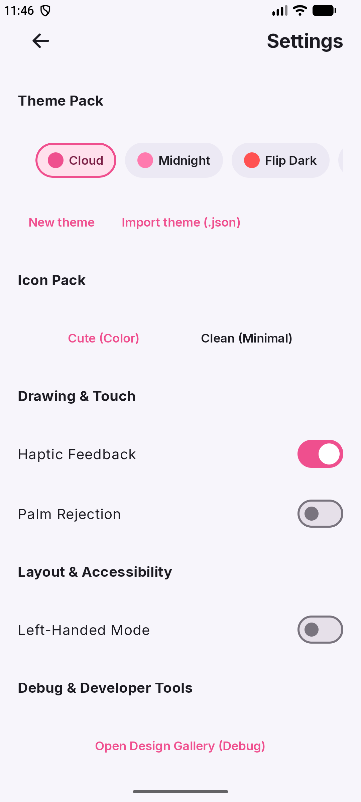

<p align="center">
  
</p>

<h1 align="center">WishyClip</h1>

<p align="center">
  <b>A free, open-source frame-by-frame 2D animation app for Android.</b><br>
  Draw, animate, add sound, export. No ads, no paywalls, no subscriptions, no tracking.
</p>

<p align="center">
  
  
  
  
</p>

> **Heads up:** WishyClip is an early beta and a small independent project, so some things may be rough or not work on your device. Please read [Known issues and limits](#known-issues-and-limits) and [tell me](#contact-and-bug-reports) if you hit a problem.
>
> *WishyClip is not affiliated with or endorsed by FlipaClip or Vblast.*

---

## Screenshots

<div align="center">
<table align="center">
  <tr>
    <td align="center"><b>Home</b><br></td>
    <td align="center"><b>New project</b><br></td>
    <td align="center"><b>Editor and timeline</b><br></td>
  </tr>
  <tr>
    <td align="center"><b>Brushes</b><br></td>
    <td align="center"><b>Text and fonts</b><br></td>
    <td align="center"><b>Themes and settings</b><br></td>
  </tr>
</table>
</div>

---

## Why Wishy?

Animation apps tend to be either locked behind a subscription or full of ads. WishyClip gives you a canvas, a timeline and the tools you need, and nothing else.

- **Free for real.** No ads, no paywall, no subscription.
- **Private by default.** Projects stay on your device. The app does not even request the internet permission.
- **Built for drawing.** Stylus pressure, optional palm rejection, a stabilizer and motion-predicted, low-latency input.
- **Bring your own stuff.** Import brush packs, fonts and themes from other apps and communities.

---

## Features

### Drawing and tools

| Feature | Details |
| --- | --- |
| **11 brushes + eraser** | Pen, Pencil, Marker, Airbrush, Calligraphy, Highlighter, Charcoal, Ink, Watercolor, Chalk and Pixel Pen. Size and opacity per brush |
| **Stabilizer** | Smooths wobbly lines, adjustable from the brush menu |
| **Stylus support** | Pressure sensitivity, low-latency input, and an optional **Palm Rejection** toggle in Settings |
| **Fill** | Flood fill with adjustable tolerance |
| **Lasso** | Freeform selection with move, resize and rotate |
| **Shapes** | Line, rectangle and ellipse |
| **Text** | Built-in fonts, plus your own `.ttf` / `.otf` files |
| **Eyedropper** | Picks the composited colour, including layer opacity and blend modes |
| **Mirror** | Left/right, top/bottom or 4-way symmetry. Works with brushes, the eraser, shapes and imported brushes |
| **Ruler** | A movable, rotatable straight edge that strokes snap to |
| **Canvas view** | Pinch zoom, pan and rotate, rotate-90 buttons and reset view |

### Layers

Add, delete, reorder, hide, lock, set opacity and **merge down**. Each layer has a blend mode: Normal, Multiply, Screen, Overlay, Darken, Lighten or Add.

### Animation

- **Frame timeline:** add, duplicate, delete, reorder, copy and paste frames, and set how long each frame is held.
- **Onion skin:** see the previous frame as a ghost while you draw.
- **Playback:** play and pause at your project's frame rate, with previous/next frame buttons.
- **Import as frames:** bring in images or a video clip.
- **Canvas presets:** Square 1:1, Landscape 16:9 and Portrait 9:16 (all 1080p), or a custom size.

### Audio

Import an audio file or **record a voiceover**, then trim it, split it at the playhead, change its volume and line it up on the timeline with a waveform lane. Multiple tracks are supported.

### Export

| Format | Output |
| --- | --- |
| **MP4** | H.264 video, with your audio tracks mixed in |
| **GIF** | Animated GIF that respects each frame's hold time |
| **PNG sequence** | A `.zip` of numbered PNG frames (`frame_001.png`, `frame_002.png`, ...) |
| **Current frame** | A single PNG |

Exports run in a foreground service with a progress notification, so you can leave the app while it works.

### Brushes, themes and layout

- **Brush import:** `.wbrush`, Krita `.kpp` and `.bundle`, Photoshop `.abr`, GIMP `.gbr` and `.gih`, and Procreate `.brush` and `.brushset`. See [`BRUSHES.md`](BRUSHES.md) for how the brush engine works.
- **Themes:** Cloud, Midnight, Flip Dark, AMOLED Black, Candy, Light and Dark, plus a theme editor and **JSON theme import**.
- **Icon packs:** Cute (colour) or Clean (minimal).
- **Layouts:** portrait and landscape, with a **left-handed mode**.

---

## Finding your way around the editor

| Button | What it does |
| --- | --- |
| **←** (top left) | Back to your projects (your work is autosaved) |
| **Undo / Redo** | Step through your history |
| **Layers** (stack icon, top bar) | Open the layer panel |
| **⋮** (top bar) | More options |
| **Tool dock** (bottom) | Brush, eraser, lasso, fill, line, text and more. Tap the brush button to open the brush picker, which also has **Import brushes** |
| **Colour circle** | Open the colour picker |
| **▶ / ⏮ / ⏭** | Play, previous frame, next frame |
| **Onion skin** button | Show or hide the previous-frame ghost |
| **Duplicate / delete frame** buttons | Copy or remove the current frame |
| **+** in the frame strip | Add a new frame |
| **+** next to *Audio* | Add or record an audio track |

---

## Getting started

### Easiest: download the APK

Grab an APK from the [Releases page](https://github.com/wishissue/WishyClip/releases) and open it on your phone. Android will ask you to allow installs from your browser or file manager the first time.

| File | Use it on |
| --- | --- |
| `WishaClip-1.0.0-arm64-v8a-release.apk` | Almost all modern phones and tablets (64-bit ARM) |
| `WishaClip-1.0.0-armeabi-v7a-release.apk` | Older 32-bit ARM devices |
| `WishaClip-1.0.0-universal-release.apk` | Any architecture (larger file) |

### Let GitHub build it for you

The CI workflow (`.github/workflows/ci.yml`) runs lint, unit tests and a debug build on every push and pull request. Open the **Actions** tab, pick the latest run and download the **debug-apk** artifact.

### Build it yourself

Requirements: **Android Studio Ladybug (2024.2.1) or newer** (needed by Android Gradle Plugin 8.7.3) and **JDK 17**.

```bash
git clone https://github.com/wishissue/WishyClip.git
cd WishyClip

./gradlew assembleDebug        # debug APK: app/build/outputs/apk/debug/
./gradlew testDebugUnitTest    # JVM unit tests
./gradlew lintDebug            # Android lint
```

Release builds (`./gradlew assembleRelease`) are shrunk and split per CPU architecture. They are only signed if you provide a `keystore.properties` file and a `keystore/` folder, which are git-ignored. Without them the release APK is unsigned and will not install, so use `assembleDebug` for a quick local build.

### Install over USB

```
adb install -r app/build/outputs/apk/debug/app-debug.apk
```

---

## Compatibility

- **Android 8.0 (API 26) and newer.** Built against Android 15 (API 35).
- **Portrait and landscape.** The editor has a layout for each, and rotating the device does not restart the app.
- **Permissions:** microphone (only when you record a voiceover), notifications and a foreground service (for export progress), and storage write access on Android 8 to 9 only (to save exports). No internet permission.

---

## What's stored, and what isn't

Everything lives in the app's private storage on your device:

- Your projects: frames and layers (as PNG bitmaps) and project info (in a local Room database)
- Audio clips you import or record
- Brushes, fonts and themes you import
- Your settings (theme, icon pack, left-handed mode, palm rejection)

Nothing is uploaded anywhere. There are no accounts, no cloud sync and no analytics, ad or crash-reporting SDKs. See [`PRIVACY.md`](PRIVACY.md) for the full policy.

---

## Under the hood

| Layer | Choice |
| --- | --- |
| **Language** | Kotlin 2.0 |
| **UI** | Jetpack Compose with Material 3, custom design system in `ui/design/` |
| **Drawing** | `DrawingSurfaceView` with Android's motion-prediction library, `StrokeRenderer` and a dab-based brush engine |
| **Storage** | Room (projects, frames, layers, audio tracks), DataStore (settings), PNG layer bitmaps |
| **Audio** | Media3 ExoPlayer for playback, `MediaRecorder` for voiceover, a waveform extractor for the timeline |
| **Export** | `MediaCodec` + `MediaMuxer` for MP4, a built-in GIF encoder, an audio mixer, and a foreground service |
| **Images** | Coil |
| **Tests** | JUnit and Robolectric unit tests for the canvas, brushes, data layer and exporter |

### Where things live

| Package | Responsibility |
| --- | --- |
| `canvas/` | Drawing surface, strokes, fill, lasso, ruler, onion skin, blending, undo |
| `brush/` | Brush file parsers and the on-disk brush store |
| `data/` | Database, repository, importers, settings, font and brush libraries |
| `audio/` | Multi-track playback, voice recording, waveforms |
| `export/` | MP4 and GIF encoders, audio mixer, export service |
| `model/` | Tools, blend modes, mirror modes, presets |
| `ui/` | Design system, components and screens |

### Developer notes

- **Toolchain:** Gradle 8.9, Android Gradle Plugin 8.7.3, Kotlin 2.0.21, Compose BOM 2024.12.01, compile and target SDK 35, min SDK 26.
- **Architecture:** MVVM. `EditorViewModel` owns the editor state, and screens are Compose functions in `ui/screens/`.
- **Adding themes, tokens or icons:** see [`DESIGN.md`](DESIGN.md).
- **Adding brush formats:** see [`BRUSHES.md`](BRUSHES.md).
- **Contributing:** see [`CONTRIBUTING.md`](CONTRIBUTING.md).

---

## Known issues and limits

Being upfront about what can go wrong:

**Early beta**
- This is the first public beta. Expect bugs, and please report them.
- **Big canvases use more memory.** The New Project screen shows an estimated cache size, so check it before choosing a very large canvas or frame rate.

**Not finished yet**
- **Layers are stored as full bitmaps.** A tiled, sparse layer store exists in the code (`canvas/TileStore.kt`) but is not connected yet.
- **Krita and Procreate brush import is best effort.** The tip shape, name and spacing are recovered, but not grain or full dynamics. Computed round brushes inside `.abr` files are skipped.
- **Palm rejection is optional** and off until you turn it on in Settings.

**Things that may go wrong**
- Imported brush packs come from many sources, and some may not import or may look different from the original app.
- Very long video imports are limited to a maximum number of frames so a clip cannot fill your device.

---

## Contact and bug reports

Something not working on your device? I want to hear about it.

- **Report a bug or ask a question:** open an issue at [github.com/wishissue/WishyClip/issues](https://github.com/wishissue/WishyClip/issues)
- **Contact me directly:** [github.com/wishissue](https://github.com/wishissue)

A good bug report includes:
- your phone or tablet model and Android version,
- what you did and what happened instead,
- a screenshot or screen recording if possible,
- the log, if you can get it: `adb logcat -d | grep -i -E "wishy|AndroidRuntime"`

Ideas, brush packs, themes and pull requests are welcome too. Read [`CONTRIBUTING.md`](CONTRIBUTING.md) and the [Code of Conduct](CODE_OF_CONDUCT.md) first. For security problems, see [`SECURITY.md`](SECURITY.md).

---

## Credits and licenses

- Code: [Apache License 2.0](LICENSE)
- Libraries: AndroidX, Jetpack Compose, Room, Media3 ExoPlayer, Coil and Kotlin Coroutines (Apache-2.0)
- Icons: Phosphor, Tabler and Lucide (MIT / ISC)
- Font: Inter (SIL OFL 1.1)

See [`THIRD_PARTY_NOTICES.md`](THIRD_PARTY_NOTICES.md) and [`ATTRIBUTIONS.md`](ATTRIBUTIONS.md) for the full accounting.

---

<p align="center">
  Made for people who love to draw. 🐱
</p>
